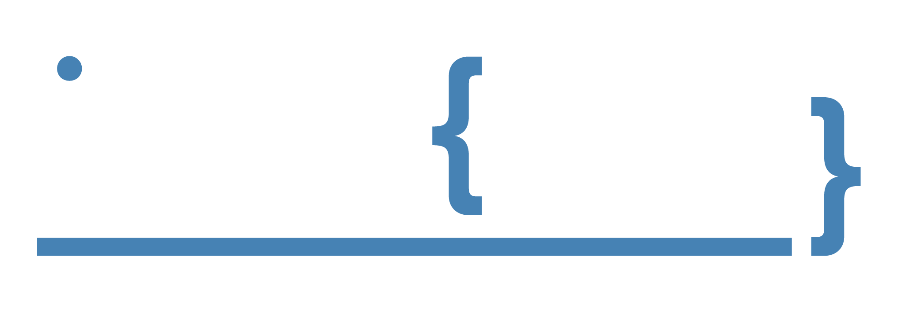

  

---

### Hi, I'm Jose Luis – Backend Developer

## [🌐 Portfolio](https://joseluiscoloma.github.io/portfolio)

---

### 🔗 Connect with me

  
  
  
  

---

### 🛠️ Languages, Technologies & Tools
#### Programming Languages

  
  
  
  
  
  

#### Frameworks

  
  
  
  

#### Databases

  
  
  
  
  

#### AI & Big Data

  
  
  
  
  
  
  
  

#### Tools & Cloud

  
  
  
  

---

### 📊 GitHub Stats

---

### 👀 Visitors

