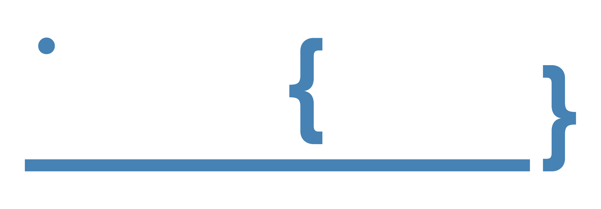

<div align="center">



# Jose Luis Coloma

### Backend Developer | Python & Django | Automation, Data & Cloud

[](https://joseluiscoloma.github.io/portfolio)
[](https://www.linkedin.com/in/jlcoloma/)
[](https://www.instagram.com/jocodev/)
[](https://www.twitter.com/jocodev)
[](https://www.codewars.com/users/jocodev)

</div>

---

## About me

I'm a backend developer focused on building reliable, scalable and well-structured software.

I enjoy working on:
- **Python backend development**
- **Django applications and APIs**
- **Automation and data processing**
- **Cloud and DevOps tooling**
- **AI and Big Data solutions**

My goal is simple: build useful products, write clean code, and keep learning every day.

---

## What I’m working on

- Building backend applications with **Python** and **Django**
- Improving my skills in **AWS**, **cloud architecture** and **DevOps**
- Exploring **AI**, **data engineering** and **automation workflows**
- Creating personal projects with real-world impact

---

## Tech Stack

### Languages
<p>
  
  
  
  
  
  
</p>

### Frameworks
<p>
  
  
  
  
</p>

### Databases
<p>
  
  
  
  
  
</p>

### AI & Big Data
<p>
  
  
  
  
  
  
</p>

### Tools & Cloud
<p>
  
  
  
  
</p>

---

## Featured areas

```text
Backend Development   → Python, Django, REST APIs
Data & Automation     → ETL, scripting, workflows, integrations
Cloud & DevOps        → AWS, Docker, CI/CD, deployment mindset
AI & Big Data         → ML tooling, data processing, scalable solutions
```

## GitHub Analytics
<div align="center">   
</div>

## Visitor Counter
<div align="center">
</div>

## Let’s connect
<p align="center"> <a href="https://www.linkedin.com/in/jlcoloma/">  </a> <a href="https://www.instagram.com/jocodev/">  </a> <a href="https://www.twitter.com/jocodev">  </a> <a href="https://www.codewars.com/users/jocodev">  </a> </p> <p align="center"> Thanks for visiting my profile. </p> 
```

